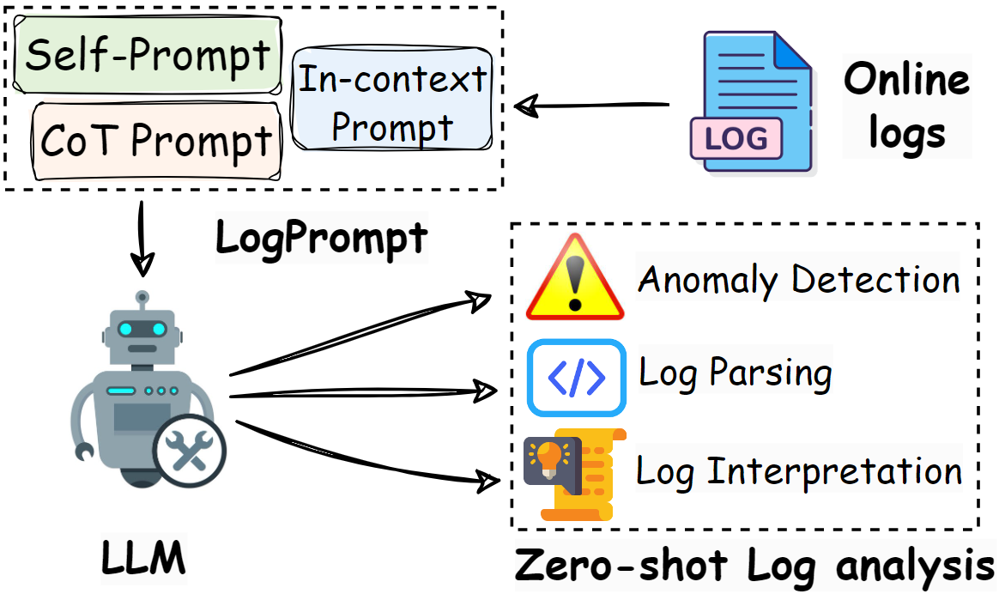
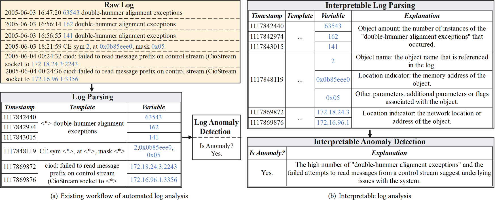

<p align="center">

</p>

# LogPrompt

This repo contains codes and the dataset for implementing and evaluating LogPrompt, a prompt engineering toolkit for log analysis with LLMs in software O\&M.

[https://arxiv.org/abs/2311.13246](https://arxiv.org/abs/2308.07610) (ICPC-2024 Long Paper/ ICSE-2024 Poster)


## 📣 Introduction
<p align="center">
    
</p>

Automated log analysis is crucial in modern software-intensive systems for facilitating program comprehension throughout software maintenance and engineering life cycles. Existing methods perform tasks such as log parsing and log anomaly detection by providing a single prediction value without interpretation. However, given the increasing volume of system events, the limited interpretability of analysis results hinders analysts' comprehension of program status and their ability to take appropriate actions. Moreover, these methods require substantial in-domain training data, and their performance declines sharply (by up to 62.5%) in online scenarios involving unseen logs from new domains, a common occurrence due to rapid software updates. In this paper, we propose LogPrompt, a novel interpretable log analysis approach for online scenarios. LogPrompt employs large language models (LLMs) to perform online log analysis tasks via a suite of advanced prompt strategies tailored for log tasks, which enhances LLMs' performance by up to 380.7% compared with simple prompts. Experiments on nine publicly available evaluation datasets across two tasks demonstrate that LogPrompt, despite requiring no in-domain training, outperforms existing approaches trained on thousands of logs by up to 55.9%. We also conduct a human evaluation of LogPrompt's interpretability, with six practitioners possessing over 10 years of experience, who highly rated the generated content in terms of usefulness and readability (averagely 4.42/5). LogPrompt also exhibits remarkable compatibility with open-source and smaller-scale LLMs, making it flexible for practical deployment.

## 🔰 Installation
```
$ pip install -r requirements.txt
```
## ✨ Usage

1. First, obtain the API key for ChatGPT (For other LLMs, please modify the API url accordingly).
   
2. Prepare your input logs into a excel file with one column 'log'.
   
3. Specify a prompt strategy from [Self,CoT,InContext]. If InContext is chosen, prepare your labelled log examples into a excel file with two columns: 'log' and 'label'. 'label' should be either 'normal' or 'abnormal'.
   
4. Run by this command:

```
python LogPrompt_code.py --API_KEY YOUR_KEY_HERE --dataset YOUR_INPUT_FILE --strategy YOUR_STRATEGY --output_file_name NAME_OF_OUTPUT --example_file LEAVE_BLANK_IF_NOT_InContext
```

5. This will output two files: first is the raw answers and prompts, second is the aligned logs and answers.

## 📘 Examples of Prompts

#### CoT prompt for anomaly detection for 25 input logs:
```
Classify the given log entries into normal and abnormal categories. Do it with these constraints: (a) Mark it normal when values (such as memory address, floating number and register value) in a log are invalid. (b) Mark it normal when lack of information. (c) Never consider <*> and missing values as abnormal patterns. (d) Mark it abnormal when and only when the alert is explicitly expressed in textual content (such as keywords like error or interrupt). Concisely explain your reason for each log. Organize your answer to be the following format: (1)x-y
(2)x-y
(3)x-y
(4)x-y
(5)x-y
(6)x-y
(7)x-y
(8)x-y
(9)x-y
(10)x-y
(11)x-y
(12)x-y
(13)x-y
(14)x-y
(15)x-y
(16)x-y
(17)x-y
(18)x-y
(19)x-y
(20)x-y
(21)x-y
(22)x-y
(23)x-y
(24)x-y
(25)x-y
(26)x-y
, where x is a binary choice between normal and abnormal, as well as the reason and y is the reason. (1) 24:01003df0 25:003682a0 26:00f71030 27:08f7a800 (2) r12=0xa0006470 r13=0x1eeeeeee r14=0x00000004 r15=0x0048eb90 (3) r16=0x08499870 r17=0xffffff60 r18=0x0839b228 r19=0x00000064 (4) 12:0045b788 13:1eeeeeee 14:009823a0 15:02a02600 (5) 16:00238bb8 17:00238e68 18:00240000 19:00238e50 (6) 4:00000000 5:01bb05d0 6:0a0c8ec0 7:00000018 (7) <*> 5:00000001 <*> 7:ff00ff00 (8) 24:00085fdc 25:00000000 26:00000000 <*> (9) 4:003b0000 5:003b0000 <*> <*> (10) fpr27=0xffffffff ffffffff <*> <*> (11) r20=0x00dde3b0 r21=0x00d8fd70 r22=0x01344e10 r23=0x00000001 (12) invalid <*> (13) <*> 3f4fffff fffffe7a 3f4fffff (14) r12=0x00000028 r13=0x1eeeeeee r14=0x0092be50 r15=0x0092c000 (15) fpr1=0x007e33f0 3fd0da8e 00000000 40368000 (16) 28:c2a385eb 29:c2a67df3 30:c2a9cc0d 31:c2ad4d2b (17) 0:00158e00 1:0feea1a0 2:1eeeeeee 3:00e4bc60 (18) lr=0x0025bd1c cr=0x84004444 xer=0x00000002 ctr=0x00289c24 (19) ciod: Error <*> node map <*> <*> <*> <*> <*> <*> <*> (20) r28=0x00022b8e r29=0x0086f8b0 r30=0x00000002 r31=0x00008000 (21) 28:0038b380 29:00238b70 30:00238df8 31:00238e20 (22) 8:04d80980 9:04d80920 10:04d80e00 11:04d80da0 (23) fpr7=0x00000011 00000048 585fa747 3fe6dba1 (24) program interrupt: fp cr field .............0 (25) fpr0=0x9da6d7a9 bfb97649 00000000 40cb7380 (26) 16:0017b5e8 17:0017b030 18:0017afcc 19:0feea640
```
#### Log parsing and variable classification with reasons for 4 input logs:
```
Explain the variable in the following logs, the variable should be classified within the category of [Object ID, Location Indicator, Object Name, Type Indicator, Switch Indicator, Time/Duration of an Action, Computing Resources, Object Amount, Status Code, Other Parameters]. Give concise explanations to each of the classified variables. Organize your answer to be the following format: (1)x_n-y_n-z_n
(2)x_n-y_n-z_n
(3)x_n-y_n-z_n
(4)x_n-y_n-z_n
, where x_n is the nth variable in that log, y_n is the category and z_n is the explanation. There are 4 logs, the logs begin:  (1) proxy.cse.cuhk.edu.hk:5070 open through proxy proxy.cse.cuhk.edu.hk:5070 HTTPS (2) connection from 221.4.102.93 () at Thu Jul  7 23:09:45 2005 (3) connection from 206.196.21.129 (host129.206.196.21.maximumasp.com) at Sat Jul  9 22:53:22 2005 (4) ready=true,policy=3,wakefulness=1,wksummary=0x0,uasummary=0x1,bootcompleted=true,boostinprogress=false,waitmodeenable=false,mode=false,manual=38,auto=-1,adj=0.0userId=0
```

## Citation
```
@inproceedings{liu2024logprompt,
  title={LogPrompt: Prompt Engineering Towards Zero-Shot and Interpretable Log Analysis},
  author={Liu, Yilun and Tao, Shimin and Meng, Weibin and Yao, Feiyu and Zhao, Xiaofeng and Yang, Hao},
  booktitle={2024 IEEE/ACM 46th International Conference on Software Engineering: Companion Proceedings (ICSE-Companion '24)},
  year={2024},
  organization={ACM},
  doi={10.1145/3639478.3643108}
}
```
```
@inproceedings{liu2024interpretable,
  title={Interpretable Online Log Analysis Using Large Language Models with Prompt Strategies},
  author={Liu, Yilun and Tao, Shimin and Meng, Weibin and Wang, Jingyu and Ma, Wenbing and Chen, Yuhang and Zhao, Yanqing and Yang, Hao and Jiang, Yanfei},
  booktitle={Proceedings of the 46th International Conference on Program Comprehension (ICPC 2024)},
  year={2024},
  organization={ACM}
}
```
